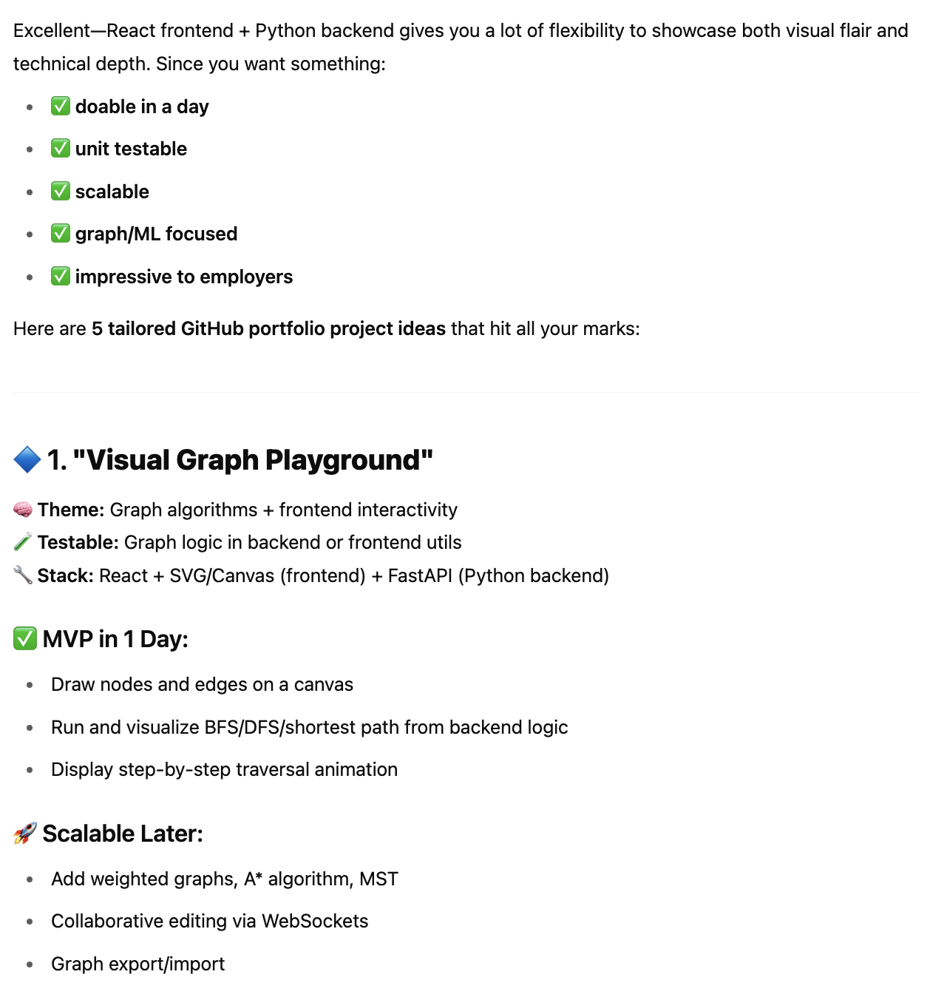

## Brainstorm

### _1. Prompt ChatGPT or AI for ideas that can be accomplished in one day and scaled up._

Example Prompt:

```
I am a [frontend dev/data science/backend] professional. 

I want to create a github portfolio piece that
showcases my skills for prospective employers. 

The piece should allow me to complete the project
within one day, be easily unit testable, and allow 
caling up later to something more complicated.


I am passionate about [...]. 

The tech stack I can work is a frontend with [...]
and a backend with [...].
 
Please provide some suggestions. Thanks!
```

AI suggestion:



### _2. Pick an option and ask the AI to put together a Product Specification document._

Example Prompt:

```
Please a create product speciication for the option
"Visual Graph Playground" in markdown.
Thanks!
```

### _3. Ask the AI to create an ordered list of stories in markdown._

Example Prompt:

```
Please create an ordered list of stories to complete for this project. Thanks!
```


### _4. Use the above to help with brainstorming and starting on your project!_