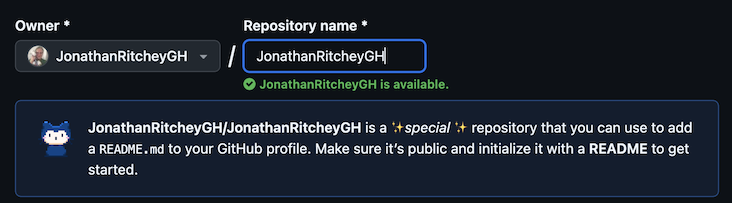
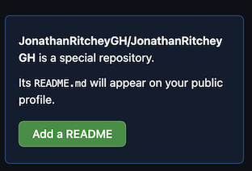

## Create Intro Page

### _1. Click `+` button on the upper right to create a new repository._


### _2. For the repository name, use the exact name under `Owner`._



Notice the comment about it being a special repository!

### _4. Use the green button add a README.md._



### _5. Customize the README.md_

_Template (I used ChatGPT to create a sample template):_

```
### 👋 Hi there, I'm Jonathan Ritchey!

#### 🚀 About Me

I'm a **software engineer** with a passion for building beautiful, intuitive, and impactful applications. I specialize in:

- 🎨 Frontend: iOS User Interaces using UIKit and SwiftUI.
- ⚙️ Automation: UI and Unit Testing, CI/CD.

#### 💼 Projects:

- 📱🧠 Educational Games
- 🌈🎶 Musical Apps

Thanks for stopping by — happy coding! 🚀
```