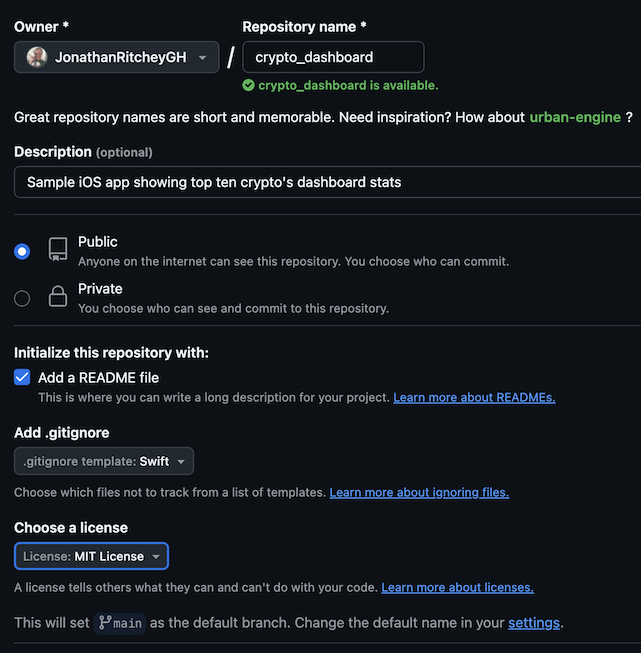

## Create Intro Page

### _1. Click `+` button on the upper right to create a new repository._

### _2. Fill out appropriate details for the new repo._

Make sure to include a description, select `Add a README file`, select the language for the `.gitignore` file, and the license type.

### _3. Clone the repo to your local machine and commit what you have so far._

This can be done using the terminal via `git` commands. Or using source control software. See github's docs on using [github desktop](https://docs.github.com/en/get-started/start-your-journey/uploading-a-project-to-github#next-steps).