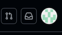
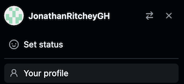
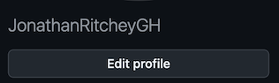
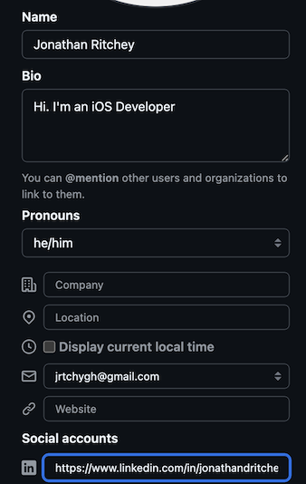
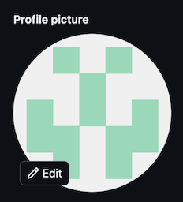
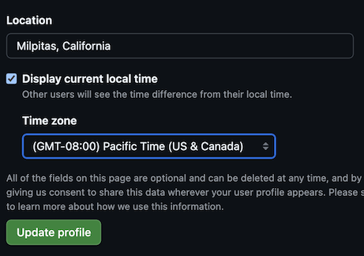

## Profile Customization

### _1. Click on the round profile button on the upper right._

_From the drop menu, select `Your profile`._

_Click on `Edit profile`._

### _2. Fill out profile. Make sure to include LinkedIn URL._

### _3. Add a profile picture by clicking on circle avatar._

### _4. Update additional profile settings._

